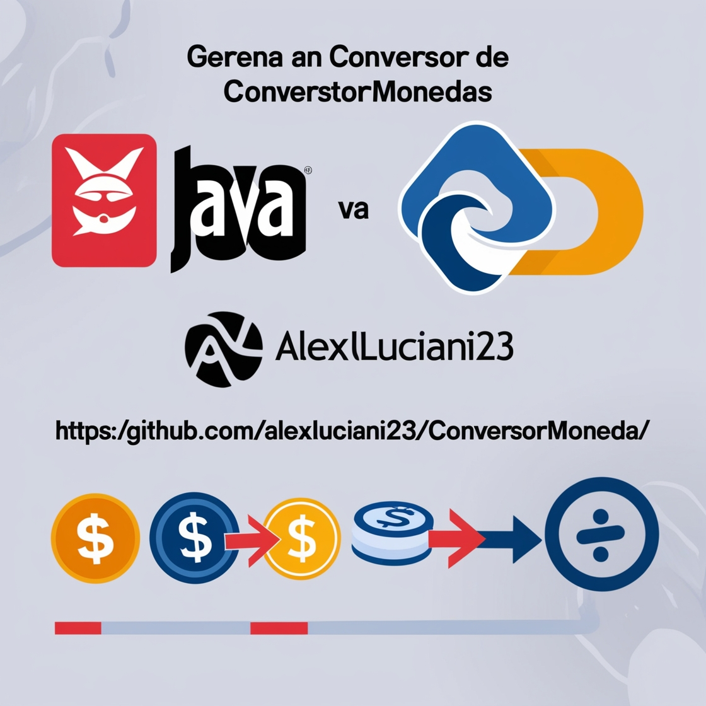

# Conversor de Monedas

Este proyecto implementa un conversor de monedas en Java que utiliza la API de [ExchangeRate-API](https://www.exchangerate-api.com/) para obtener tasas de cambio actualizadas.

## Funcionalidades

* Convierte entre diferentes monedas, incluyendo:
    * Dólar estadounidense (USD)
    * Peso argentino (ARS)
    * Real brasileño (BRL)
    * Peso chileno (CLP)
    * Peso colombiano (COP)
    * Boliviano boliviano (BOB)
* Obtiene tasas de cambio actualizadas desde la API de ExchangeRate-API.
* Maneja errores en caso de que la moneda de destino no esté disponible o haya problemas con la API.

## Cómo compilar y ejecutar

1. **Clona el repositorio:**bash git clone https://github.com/tu_usuario/conversor-moneda.git
2. **Instala Maven:** Asegúrate de tener Maven instalado en tu sistema. Puedes descargarlo desde [https://maven.apache.org/](https://maven.apache.org/).
3. **Compila el proyecto:** Abre una terminal en la carpeta raíz del proyecto y ejecuta el comando: bash mvn exec:java -Dexec.mainClass="Principal"
## Dependencias

Este proyecto utiliza la librería Gson para parsear los datos JSON de la API. La dependencia está especificada en el archivo `pom.xml`.

