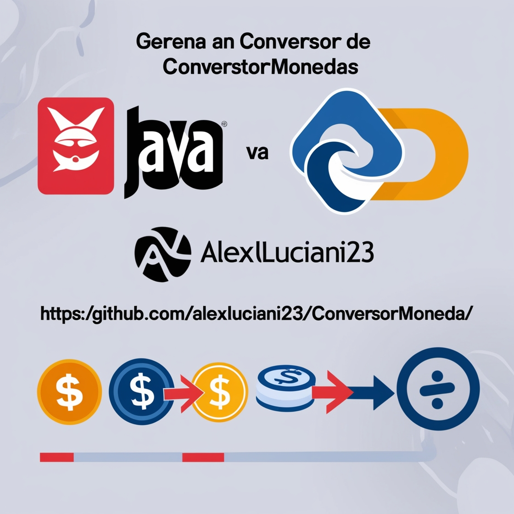

# Conversor de Monedas

Este proyecto implementa un conversor de monedas en Java que utiliza la API de [ExchangeRate-API](https://www.exchangerate-api.com/) para obtener tasas de cambio actualizadas en tiempo real. Permite a los usuarios convertir entre una variedad de monedas de forma rápida y sencilla.

## Funcionalidades

* **Convierte entre múltiples monedas:** El conversor soporta las siguientes monedas:
    * Dólar estadounidense (USD)
    * Peso argentino (ARS)
    * Real brasileño (BRL)
    * Peso chileno (CLP)
    * Peso colombiano (COP)
    * Boliviano boliviano (BOB)
* **Tasas de cambio actualizadas:** Obtiene las tasas de cambio más recientes directamente desde la API de ExchangeRate-API, asegurando conversiones precisas.
* **Manejo de errores robusto:** El sistema está diseñado para manejar errores como monedas no disponibles o problemas de conexión con la API, proporcionando mensajes informativos al usuario.

## Cómo compilar y ejecutar

1. Clona el repositorio: Abre una terminal y ejecuta el siguiente comando para clonar el repositorio en tu computadora:
bash git clone https://github.com/AlexLuciani23/ConversorMoneda.git
2. Instala Maven: Asegúrate de tener Maven instalado en tu sistema. Puedes descargarlo desde https://maven.apache.org/. Si ya lo tienes instalado, puedes verificar la versión ejecutando el comando mvn -v.

3. Navega a la carpeta del proyecto: En la terminal, utiliza el comando cd para navegar a la carpeta raíz del proyecto que acabas de clonar:
   cd ConversorMoneda
4. Compila el proyecto: Ejecuta el siguiente comando para compilar el código fuente del proyecto:
    mvn compile

5. Ejecuta el proyecto: Una vez compilado, ejecuta el siguiente comando para iniciar el conversor de monedas:
   mvn exec:java -Dexec.mainClass="Principal"
   
6. Sigue las instrucciones en pantalla: El programa mostrará un menú con las opciones de conversión disponibles. Sigue las instrucciones para realizar las conversiones que desees.
Ejemplo de salida:

*** Conversor de Monedas ***
1. Dólar a Peso Argentino
2. Peso Argentino a Dólar
3. Dólar a Real Brasileño
4. Real Brasileño a Dólar
5. Dólar a Peso Colombiano
6. Peso Colombiano a Dólar
0. Salir
Ingrese una opción:

Al ejecutar el programa, deberías ver una salida similar a la siguiente en la consola:

## Dependencias

Este proyecto utiliza la librería Gson para parsear los datos JSON recibidos de la API. La dependencia está gestionada a través del archivo `pom.xml`.

## Ejemplos de uso
## Dependencias

Este proyecto utiliza la librería Gson para parsear los datos JSON recibidos de la API. La dependencia está gestionada a través del archivo `pom.xml`.

## Ejemplos de uso

**Ejemplo 1: Convertir dólares a pesos argentinos**

1. Ejecuta el programa.
2. Selecciona la opción "1. Dólar a Peso Argentino".
3. Ingresa la cantidad de dólares que deseas convertir.
4. El programa mostrará el equivalente en pesos argentinos.

